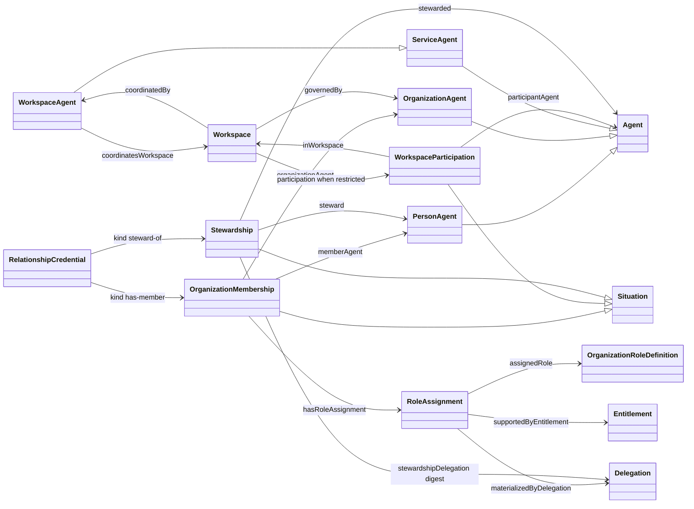
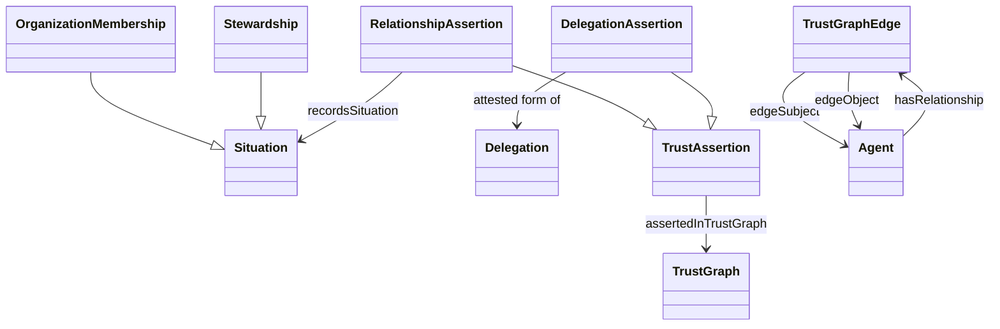
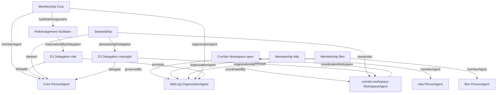
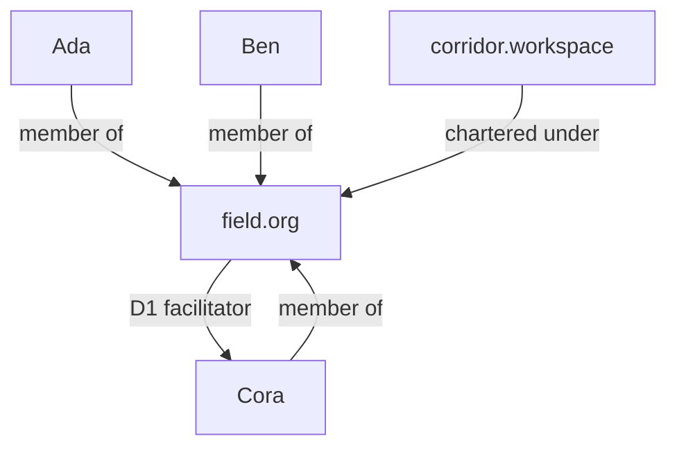
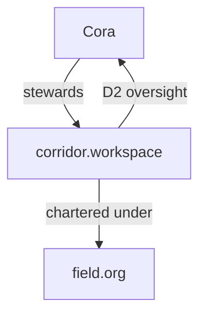

# Membership, role, and stewardship

How a person belongs to an organization, how a role on that membership becomes authority, and how stewardship of an agent is a different situation. The classes are `aporg:OrganizationMembership`, `aporg:RoleAssignment`, and `ap:Stewardship`. Those situations, the charter link, and the delegations that carry their authority are the edges of the Agentic Trust graph (`at:TrustGraph`). The field app and the card-room game both bind these. Neither invents a steward flag on a member row, and neither draws a second picture of who is related to whom.

Sources: `packages/ontology/tbox/org.ttl`, `packages/ontology/tbox/core.ttl`, `packages/ontology/tbox/trust.ttl`, `packages/ontology/tbox/verification-receipt.ttl`. The Agentic Trust T-box mirrors the same terms under `at:` with `rdfs:seeAlso`. `at:TrustGraph` is declared there.

## The three situations

A person who belongs, holds a role, and oversees an agent is three records.

| Situation | Class | What it says | What it never says |
| --- | --- | --- | --- |
| Membership | `aporg:OrganizationMembership` | This person is a member of this organization right now. | That she may act for it, spend, or sign. |
| Role | `aporg:RoleAssignment` | This membership carries this named role, and this delegation materializes it. | That the role word itself is the grant. |
| Stewardship | `ap:Stewardship` | This person oversees this agent, on the strength of that agent's oversight delegation to her. | That she is a member, or that she custodies the key. |

`Member` is not a class. Membership is a situation that starts and ends. `Steward` is not a class. Stewardship is a situation. A role definition is a vocabulary entry. The grant is always an `apdel:Delegation`.

## Class diagram

`stewarded` ranges over an agent that is an organization or a service. It never ranges over a person, and it never ranges over the `aporg:Workspace` entity. The workspace does not sign. Its agent does.

`organizationAgent` ranges over `ap:OrganizationAgent` (an organization, a team, or an alliance). It does not range over `ap:WorkspaceAgent`. People are not members of the workspace agent. They are members of the organization that governs the workspace, and the workspace admits them from that membership.

## Membership

`aporg:OrganizationMembership` is a situation between one `ap:PersonAgent` (`aporg:memberAgent`) and one `ap:OrganizationAgent` (`aporg:organizationAgent`).

It records that the person is a member now. It authorizes nothing. Ending it is `aporg:MembershipTermination`. An `aporg:EnrollmentDecision` creates the membership. Accepting an invite does not hand the person the organization's authority.

`aporg:memberOf` is derived. It is true while a current membership exists. Nothing asserts it as a stored edge.

A contact (`aporg:ContactRelationship`) is a person the organization knows. A contact is not a member.

## The role, and the delegation that makes it authority

`aporg:OrganizationRoleDefinition` names a role inside one organization: facilitator, treasurer, dealer. The definition does not authorize execution. Two organizations can both have a role called treasurer. The word does not travel.

`aporg:RoleAssignment` connects one membership to one role definition.

- `aporg:assignedRole` names the definition.
- `aporg:materializedByDelegation` points at the `apdel:Delegation` that carries the role's permissions.
- `aporg:supportedByEntitlement` points at an entitlement when the role is a data permission rather than an action.

The assignment is not the authority. The delegation is. Revoking the delegation drops what the role could do and leaves the membership in place. Ending the membership ends the role with it. A role without a delegation is a label.

This is the "a relationship has a role that relates to a delegation" sentence. The relationship is the membership. The role hangs off that membership. The delegation hangs off the role. Stewardship is not that role.

## Stewardship

`ap:Stewardship` is its own situation.

- `ap:steward` is a `ap:PersonAgent`.
- `ap:stewarded` is the agent she oversees: an organization agent or a service agent, never a person, never a workspace entity.
- `ap:stewardshipDelegation` is the digest of the oversight delegation that agent signed to her (spec 246). The digest is the record. The delegation is the authority.

Standing, never authority. A verifier does not read a stewardship row as permission. It reads the delegation the digest names, the same way it reads any other grant.

Stewardship is not custody. `ap:CustodyMember` is the set of keys that can sign for the account. Holding the key is not overseeing the agent, and overseeing the agent is not holding the key.

Stewardship is not membership. A steward need not be a member. A member does not steward. When one person is both, she has two situations.

## How a credential names them

`ap:RelationshipCredential` is a private record in the subject's vault. It grants nothing. Its kind picks which situation it is evidence of.

| Credential kind | Projects to |
| --- | --- |
| `has-member` | `aporg:OrganizationMembership` |
| `steward-of` | `ap:Stewardship` |
| `chartered-under` | `ap:charteredUnder` |

`ap:charteredUnder` is belonging. A team is chartered under an organization. A workspace agent is chartered under the organization that governs its workspace. The child keeps its own custody. A resolver may follow the link. A verifier may not read it as permission.

## The Agentic Trust graph

`at:TrustGraph` is the queryable, versionable artifact of trust assertions, endorsements, delegations, and registry entries about agents. Discovery filters with it (`at:consultsTrustGraph`). Scoring reads it. It is an information artifact: content that can be published, committed, and cited. It is the document of the situations above. It is not a fourth situation, and a verifier does not treat a node in it as permission.

Each relationship becomes an edge by being recorded as a trust assertion. `at:recordsSituation` points the assertion at the situation. `at:assertedInTrustGraph` places the assertion in the graph.

| Relationship | Assertion | The edge answers |
| --- | --- | --- |
| Membership (`has-member`) | `at:RelationshipAssertion` | Which agents belong together |
| Stewardship (`steward-of`) | `at:RelationshipAssertion` | Who oversees this agent |
| Charter (`chartered-under`) | `at:RelationshipAssertion` | What this agent sits under |
| The role's grant | `at:DelegationAssertion` | Who authorized this role |
| The oversight grant | `at:DelegationAssertion` | Who authorized this steward to act |

`at:RelationshipAssertion` is the assertion that two agents are related. `at:DelegationAssertion` is the attested record of a grant, and it is what other assertions cite when they need to say the relation was authorized. Membership and stewardship stay relationship edges. The two delegations stay delegation edges. One person who is a member, a facilitator, and a steward is three edges, plus the two grants, in one graph.

When the relationship is public and both parties have confirmed it, the same fact is one `aptrust:TrustGraphEdge`. `ap:hasRelationship` hangs that edge on each endpoint. The edge states its subject, its object, its relationship type, and its status absolutely. Subject proposed it. Object confirmed it. Status runs PROPOSED, CONFIRMED, ACTIVE, REVOKED. Only an ACTIVE edge may inform a score. `aptrust:TrustScore` is a number computed over evidence under a named policy and a graph snapshot. The score is derived. The edge is the relationship. Neither one is authority.

A private relationship stays a `ap:RelationshipCredential` in both vaults. That credential is the edge from each holder's vantage point. It is not copied into the public graph. Reading the public graph reveals nothing that reading the chain would not reveal.

So the graph a person sees, centered on an agent, is a reading of these assertions and nothing else. Members are membership edges. The steward is a stewardship edge. A role that has authority is a delegation edge off that membership. Charter is the edge from a child agent to the organization it sits under. There is no separate social model for the app to keep in step.

## The workspace

Four objects, not one.

| Object | Class | What it is |
| --- | --- | --- |
| The plane | `aporg:Workspace` | A governed coordination context. Not an agent. No address, no custody, no authority. |
| The governor | `ap:OrganizationAgent` | `aporg:governedBy`. Every policy the workspace has comes from this agent. |
| The face | `ap:WorkspaceAgent` | The service agent that acts for that one workspace. `aporg:coordinatedBy` / `aporg:coordinatesWorkspace`. |
| The people | `ap:PersonAgent` | Members of the governor. Participants in the workspace only by the rule below. |

`aporg:workspaceParticipationPolicy` is `open` or `restricted`.

- **Open.** Participation is derived. Every current member of the governing organization participates. `aporg:WorkspaceParticipation` must not be asserted.
- **Restricted.** Participation is its own situation: `aporg:participantAgent` and `aporg:inWorkspace`. It still authorizes nothing. Being in the room is not a grant.

The workspace agent acts only inside what the governor delegated to it. Revoke that delegation and the workspace agent is inert. It is never an independent source of authority.

Product language "steward of the workspace" means `ap:Stewardship` whose `ap:stewarded` is the **workspace agent** (or, when the social face is itself an organization, that organization agent). It does not mean a role on a membership, and it does not mean a property of the workspace entity.

## Worked example

Corridor is an open workspace for a field team. Four people. One of them facilitates, and that same person stewards the workspace agent.

| Object | Address in the example | Class |
| --- | --- | --- |
| Field | `field.org` | `ap:OrganizationAgent` |
| Corridor | the workspace entity | `aporg:Workspace`, `governedBy` `field.org`, policy `open` |
| The workspace agent | `corridor.workspace` | `ap:WorkspaceAgent`, `coordinatesWorkspace` Corridor |
| Ada, Ben, Cora | three person agents | `ap:PersonAgent` |

Ada, Ben, and Cora each have an `aporg:OrganizationMembership` with `organizationAgent = field.org`. Because Corridor is open, all three participate. No `WorkspaceParticipation` rows are stored.

Cora's membership has one `aporg:RoleAssignment`.

- `assignedRole` = Field's role definition `facilitator`.
- `materializedByDelegation` = delegation **D1**, `field.org` → Cora, methods pinned to what a facilitator may do.

D1 is the authority of the role. Ada and Ben have memberships and no such assignment. They belong. They cannot facilitate.

Cora also has an `ap:Stewardship`.

- `steward` = Cora.
- `stewarded` = `corridor.workspace`.
- `stewardshipDelegation` = the digest of delegation **D2**, `corridor.workspace` → Cora, the oversight delegation the workspace agent signed to her.

D2 is the authority of the stewardship. It is not D1. Ending her facilitator role revokes D1 and leaves D2. Ending her stewardship revokes D2 and leaves her membership and, if it is still current, D1. Removing her from Field ends the membership and the role. It does not, by itself, revoke D2. Someone has to revoke the oversight delegation.

She is not a custody member of `corridor.workspace`. The key stays with the account's custodians. She acts for the workspace agent only where D2 says so.

What a reader should be able to answer from the diagram without guessing:

- Who belongs to Field? Ada, Ben, and Cora. Three memberships.
- Who may facilitate? Cora, because D1 materializes that role. Not because she is a member.
- Who stewards the workspace? Cora, because a stewardship names her and `corridor.workspace`, evidenced by D2.
- Who participates in Corridor? Ada, Ben, and Cora, derived from Field's membership because the workspace is open.
- Who holds the workspace agent's key? Not Cora. Not shown, because custody is a different class.

### The same facts, as the trust graph

Centered on `field.org`, the graph is the membership edges, Cora's role grant, and the workspace agent's charter. Ada, Ben, and Cora appear because they are members. Corridor's agent appears because it is chartered under Field. Cora's stewardship does not appear here: that edge is about `corridor.workspace`, not about Field.

Centered on `corridor.workspace`, the graph is the stewardship edge, the oversight grant, and the charter back to Field. Ada and Ben are not edges of this agent. An open workspace admits them by reading Field's membership edges through the charter, which is a reading of the graph that already exists.

One set of records. Two centers. The field app's picture of "who is on this team" is the first graph. Its picture of "who stewards this workspace" is the second. The game's picture of a club is the same reading with the club agent as the center: membership edges in, the host's stewardship edge in, a dealer role as a delegation edge on that membership.

## The same shape in the game

A card-room club is an `ap:OrganizationAgent` (the game's club class specializes organization). The club's address is the workspace smart agent the table runs as. Two consequences fall out of the classes above, and the game already follows them.

- Members are `aporg:OrganizationMembership` on that organization. The roster is not a table in the app.
- The host is the steward of that agent: `ap:Stewardship` with `stewarded` equal to the club agent. It is derived. It is not a column on the member row.

A host who is also a member has both records. Her dealer role, if she has one, is a `RoleAssignment` on the membership, materialized by its own delegation. Dealing is not stewardship. Hosting is not membership.

## What the field app binds

The field app uses the same three situations. It does not add a field-only steward class, and it does not store "steward" as a role name that the app treats as permission.

| Product sentence | Record |
| --- | --- |
| Ada is on the team | `OrganizationMembership`: Ada, `field.org` |
| Cora is the facilitator | `RoleAssignment` on Cora's membership, `materializedByDelegation` = D1 |
| Cora stewards the workspace | `Stewardship`: Cora, `corridor.workspace`, digest of D2 |
| Anyone on the team can be in this workspace | Corridor is `open`; participation is derived |
| Only some members may enter | Corridor is `restricted`; assert `WorkspaceParticipation` for those people |
| The workspace sits under Field | `governedBy` Field, and `charteredUnder` from the workspace agent to Field |

A string match on a person's name, a boolean on a member row, and a prompt sentence are not substitutes for these records. A roster, a steward flag, or a diagram stored beside them is a second graph. The Agentic Trust graph is the one the app reads.

## What not to model

- One address that is both the person and the organization. A person agent and an organization agent are different accounts.
- Stewardship as a role definition on the membership. That collapses two situations and makes "she left the team" silently end her oversight, or the reverse.
- The role definition as the grant. Without `materializedByDelegation`, the role authorizes nothing.
- Membership as a grant. Joining does not delegate.
- Stewardship as custody. The oversight delegation is how she acts for the agent. The key is how the account signs.
- `memberOf` or `WorkspaceParticipation` asserted on an open workspace. Both are derived. Asserting them creates a second opinion about who is in the room.
- A membership whose `organizationAgent` is the workspace agent. The range is an organization. Point the membership at the governor. Point the stewardship at the workspace agent.
- A trust graph drawn from names, avatars, or a table in the app. Every edge is one of the assertions above, or it is not an edge.
